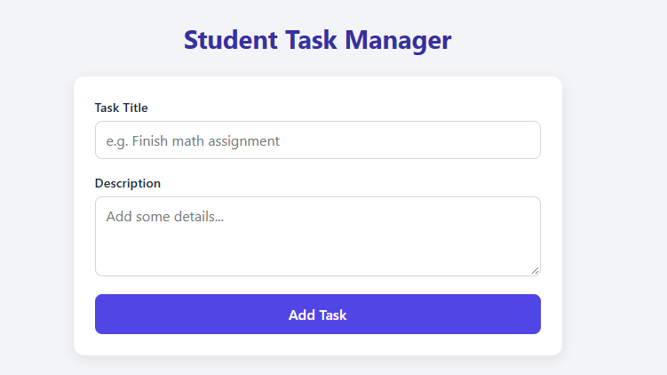
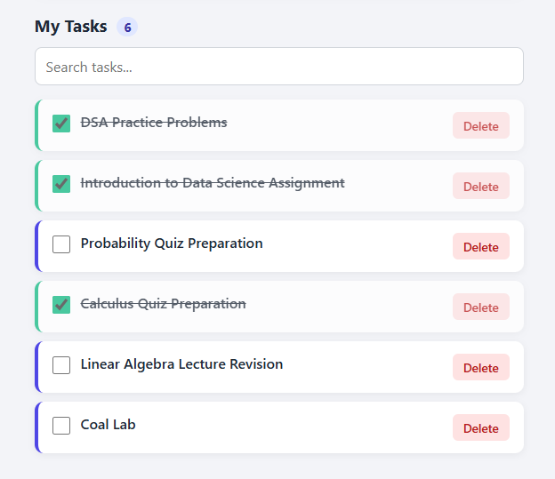

# Student Task Manager

---

## Project Description

Student Task Manager is a simple web application that helps students organize their coursework. Users can add tasks with a title and description, view them in a list, mark them as completed, delete them, and search through them. Tasks are stored in the browser's `localStorage`, so no backend or database is required.

The application itself is intentionally basic. The main purpose of this project is to practice **collaborative development using Git and GitHub** as a pair.

## Team Members

| Name | GitHub Username | Responsibility |
|------|-----------------|----------------|
| `Muhammad Zia` | `@ZiaPrince2691` | `HTML structure and JavaScript` |
| `Ayesha Tariq` | `@AyeshaTariq0922118` | `CSS styling` |

## Features

- **Add tasks** with a required title and an optional description
- **Display tasks** in a styled list with a live task counter
- **Mark tasks as completed** using a checkbox (completed tasks are struck through)
- **Delete tasks** with a single click
- **Search tasks** by title or description, filtered as you type
- **Persistent storage**: tasks remain after a page refresh
- **Responsive layout** that works on desktop and mobile screens

## Technologies

| Category | Tools |
|----------|-------|
| Structure | HTML5 |
| Styling | CSS3 |
| Logic | Vanilla JavaScript (ES6) |
| Storage | Browser `localStorage` |
| Version control | Git |
| Collaboration | GitHub |

## Git Workflow

We used a **feature-branch workflow**:

1. `main` always holds stable, working code.
2. `develop` is the integration branch where finished features are combined.
3. Each feature is built on its own `feature/*` branch created from `develop`.
4. When a feature is finished, the author opens a **Pull Request** into `develop`.
5. The other team member **reviews** the Pull Request, leaves comments if needed, and approves it.
6. After approval the branch is merged and deleted.
7. When `develop` is stable, it is merged into `main` and tagged with a version number.

## Branches

> Update this table so it matches the real branches in your repository.

| Branch | Purpose |
|--------|---------|
| `main` | Stable, release-ready code |
| `develop` | Integration branch for completed features |
| `feature/add-task-form` | HTML form and base page layout |
| `feature/task-list` | Rendering tasks and the task counter |
| `feature/complete-delete` | Completing and deleting tasks |
| `feature/search` | Search/filter functionality |
| `docs/readme` | README and documentation |

## Git Commands Demonstrated

> Keep only the commands your team actually used.

| Command | Purpose |
|---------|---------|
| `git init` | Create a new local repository |
| `git clone` | Copy the remote repository to a local machine |
| `git status` | Check the state of the working directory |
| `git add` | Stage changes for commit |
| `git commit -m` | Save staged changes with a message |
| `git log --oneline` | View commit history |
| `git branch` | List, create, or delete branches |
| `git checkout -b` / `git switch -c` | Create and switch to a new branch |
| `git merge` | Combine branches |
| `git diff` | Compare changes |
| `git remote add origin` | Link the local repo to GitHub |
| `git push` | Upload commits to GitHub |
| `git pull` | Download and merge changes from GitHub |
| `git fetch` | Download remote changes without merging |
| `git stash` | Temporarily shelve uncommitted changes |
| `git tag` | Mark release versions |
| `git revert` / `git reset` | Undo changes |

## GitHub Features Demonstrated

- Repository creation
- Adding a collaborator to the repository
- Branch creation and management
- Pull Requests with descriptions
- Code review (comments and approvals)
- Merge conflict resolution
- Issues for tracking tasks and bugs
- Commit history and contributor graph
- Tags and Releases for version numbers

## How to Run

### Prerequisites

- A modern web browser (Chrome, Firefox, Edge, or Safari)
- Git (to clone the repository)

### Steps

1. Clone the repository:
   ```bash
   git clone https://github.com/<username>/student-task-manager.git
   ```
2. Move into the project folder:
   ```bash
   cd student-task-manager
   ```
3. Open `index.html` in your browser.

   Or serve it locally (optional):
   ```bash
   python -m http.server 8000
   ```
   Then visit `http://localhost:8000`.

### Project Structure

```
student-task-manager/
├── index.html       # Page structure
├── style.css        # Styling
├── script.js        # Application logic
└── README.md
```

## Screenshots

| Screen | Preview |
|--------|---------|
| Add task form |  |
| Task list with tasks |  |

## Version History

| Version | Day |
|---------|-----|
| v1.0.0 | 4<sup>th</sup> Oct, 2026 | 

## Contributors

| Name | GitHub | Contribution |
|------|--------|--------------|
| `Muhammad Zia` | [@ZiaPrince2691](https://github.com/ZiaPrince2691) | `HTML structure and JavaScript` |
| `Ayesha Tariq` | [@AyeshaTariq0922118](https://github.com/AyeshaTariq0922118) | `CSS styling` |
---

<!-- *Created as part of the Git & GitHub Collaborative Assignment.* -->